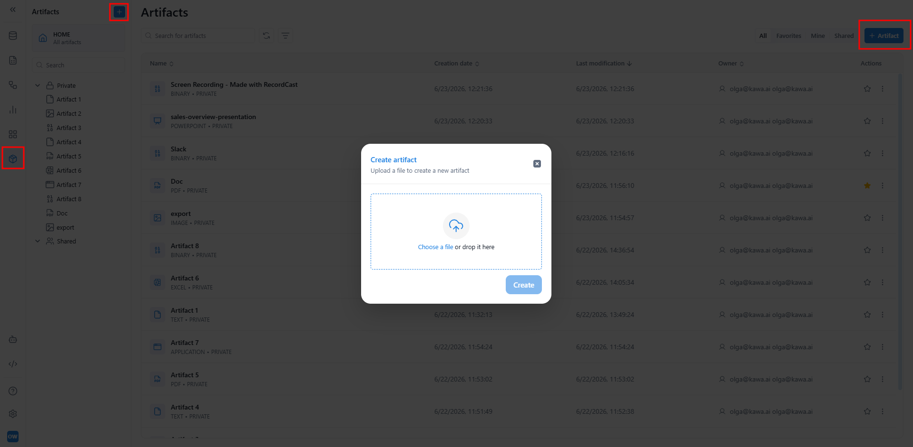
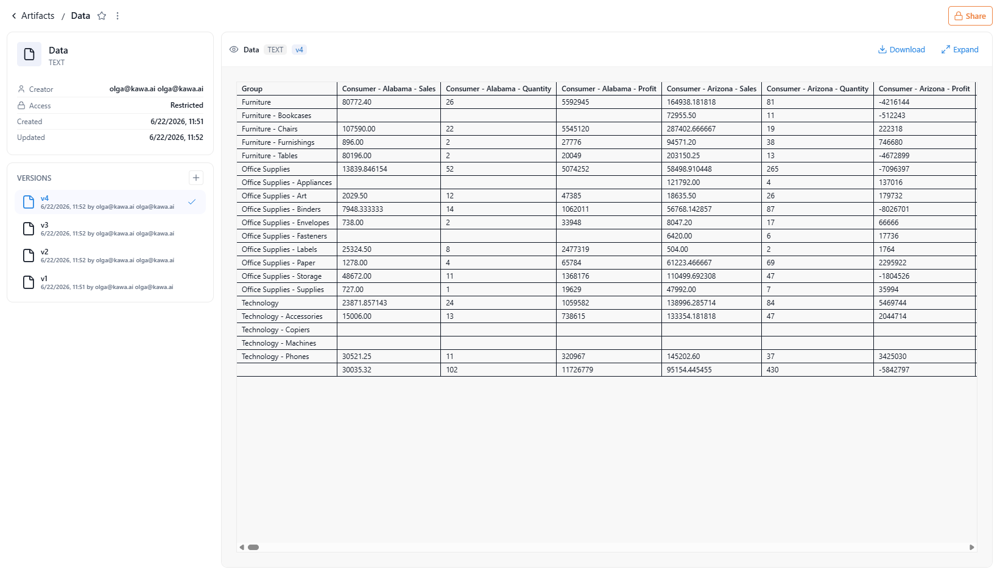
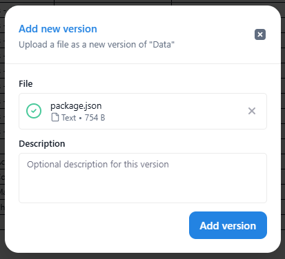

# Artifacts

See definitions in [Terminology](13_00_terminology.md#artifact) section.

The **Artifacts** tab is a workspace-level library for the files you bring into KAWA. It gives you a single place to upload, store, preview, version, and download files — PDFs, images, presentations, spreadsheets, text, application files, and other binaries — without leaving the platform.

Where sheets hold your modeled data and dashboards hold your live views, the Artifacts tab holds your **files**: the documents and deliverables you want to keep, version, and share with your team.

### 1. Creating an artifact

Artifacts are created by uploading a file from your computer.

Click (+ Artifact) at the top right — or the (+) button at the top of the left panel — to open the **Create artifact** dialog. The dialog opens on a file area: click (Choose a file) or drop a file onto it. Once the file is added, it appears as a chip showing its type, name, and size, with an (×) to remove or replace it, and the **Artifact name** field appears pre-filled with the file's name (without the extension). Adjust the name if needed, then click (Create).

<figure><figcaption></figcaption></figure>

The new artifact appears in the list and is created as version 1. KAWA detects the file type automatically and labels the artifact accordingly (for example, `TEXT`, `PDF`, or `BINARY`).

> Files of an unsupported type are rejected, with feedback shown directly in the dialog.

### 2. Viewing an artifact

Click an artifact's name to open its detail page. The detail page has three parts.

#### 2.1 Details panel

The left of the detail page summarizes the artifact:

* **Creator** — the user who created it.
* **Access** — the artifact's visibility (for example, _Restricted_).
* **Created** and **Updated** — the creation and last-modification timestamps.

#### 2.2 Versions panel

Below the details, the **VERSIONS** panel lists every version of the artifact (v1, v2, and so on), each with its timestamp and author. The current version is marked with a check. Select any version to preview it, or use the (+) button to add a new version (see section **Versions**).

#### 2.3 Preview pane

The main area previews the selected version's contents. For supported types, KAWA renders the file directly in the browser — for example, a text data file is shown as a table. The preview header offers two actions:

* **Download** — save the current version to your computer in its original format.
* **Expand** — open the preview in a larger, full-width view.

<figure><figcaption></figcaption></figure>

### 3. Versions

An artifact keeps a full history of its **versions**. To add one, click the (+) button in the VERSIONS panel to open the **Add new version** dialog. Upload the new file the same way as when creating an artifact — drop it onto the file area or click (Choose a file), and it appears as a chip with its type, name, and size. You can also enter an optional **Description** for this specific version. Click (Add version) to save: KAWA stores it as a new version and keeps the previous ones.

This lets you update a file — a revised report, an updated deck, a corrected dataset — without losing what it replaced. The latest version is shown by default, and you can select any earlier version to preview or download it.

<figure><figcaption></figcaption></figure>

