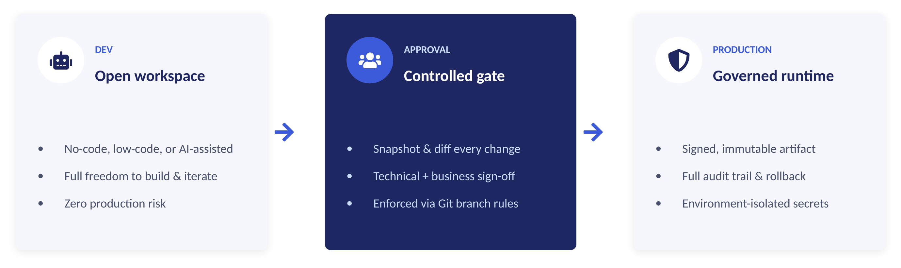
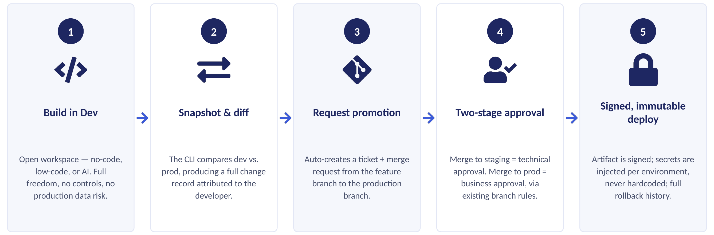
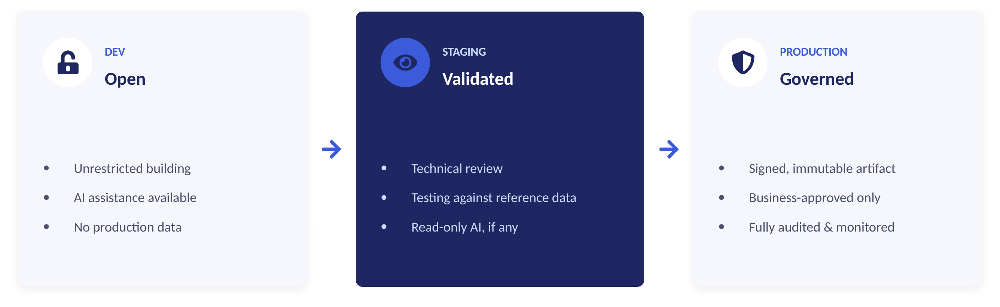
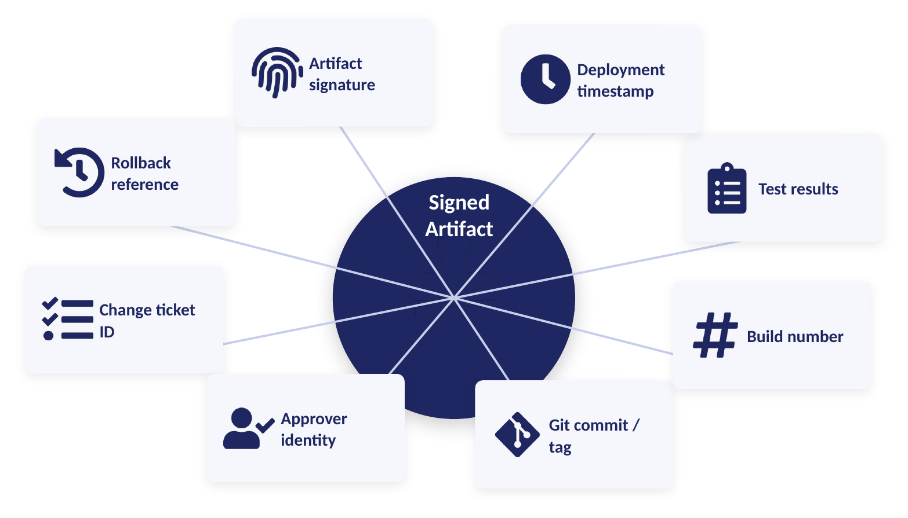
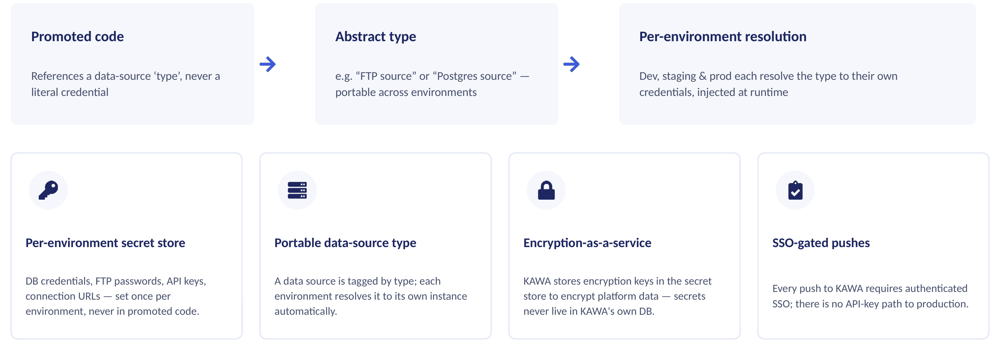

# Governed delivery & SOX controls

KAWA separates unrestricted experimentation from controlled, auditable delivery. A citizen developer can build anything in an open workspace — but nothing reaches production without traceable, gated approval. This page describes how KAWA enforces governed promotion from development to production, and how each SOX control is built into the promotion path itself.

## 1. Governance model

**Build freely. Promote only what's approved.** Every change moves through three stages, from an open workspace to a governed runtime.

<figure><figcaption></figcaption></figure>

| Stage                             | Principle                         | What it means                                                   |
| --------------------------------- | --------------------------------- | --------------------------------------------------------------- |
| **Dev** — open workspace          | No-code, low-code, or AI-assisted | Full freedom to build and iterate. Zero production risk.        |
| **Approval** — controlled gate    | Snapshot & diff every change      | Technical and business sign-off, enforced via Git branch rules. |
| **Production** — governed runtime | Signed, immutable artifact        | Full audit trail and rollback. Environment-isolated secrets.    |

## 2. Promotion pipeline

**From first edit to signed production deploy.** A change follows the same five steps every time.

<figure><figcaption></figcaption></figure>

| # | Step                     | What happens                                                                                         |
| - | ------------------------ | ---------------------------------------------------------------------------------------------------- |
| 1 | Build in Dev             | Open workspace — no-code, low-code, or AI. Full freedom, no controls, no production-data risk.       |
| 2 | Snapshot & diff          | The CLI compares dev vs. prod, producing a full change record attributed to the developer.           |
| 3 | Request promotion        | Auto-creates a ticket and merge request from the feature branch to the production branch.            |
| 4 | Two-stage approval       | Merge to staging = technical approval. Merge to prod = business approval, via existing branch rules. |
| 5 | Signed, immutable deploy | Artifact is signed; secrets are injected per environment, never hardcoded; full rollback history.    |

> **Note:** AI assistance is available only in the Dev workspace. It becomes read-only — or unavailable — once code is promoted.

## 3. SOX controls

### 3.1 Segregation of duties

**No single person builds, approves, and deploys.** Three distinct roles must act before a change reaches production, and the same person can never fill two of them for the same change.

| Role               | Responsibility                                                              |
| ------------------ | --------------------------------------------------------------------------- |
| Citizen Developer  | Builds in the open workspace, snapshots the change, and requests promotion. |
| Technical Approver | Reviews the code and logic change, and merges it into the staging branch.   |
| Business Approver  | Confirms the business impact and merges the change into production.         |

> **Note:** Enforced structurally through Git branch-protection rules — not by policy alone.&#x20;

### 3.2 Environment isolation

**Three isolated environments, one governed path.** Work always starts in an open environment and only reaches production through the promotion pipeline. Each stage has a different risk posture, and different controls apply at each.

<figure><figcaption></figcaption></figure>

| Environment | Posture   | Controls                                                                         |
| ----------- | --------- | -------------------------------------------------------------------------------- |
| Dev         | Open      | Unrestricted building. AI assistance available. No production data.              |
| Staging     | Validated | Technical review. Testing against reference data. Read-only AI, if any.          |
| Production  | Governed  | Signed, immutable artifact. Business-approved only. Fully audited and monitored. |

### 3.3 Traceability

**Every deployment carries its own evidence.** Each signed artifact is bound to a complete audit record — not stored separately, but attached to the change itself, so evidence can never drift from the deployment it describes.

<figure><figcaption></figcaption></figure>

Each signed artifact carries:

* Change ticket ID
* Git commit / tag
* Approver identity
* Build number
* Test results
* Artifact signature
* Deployment timestamp
* Rollback reference

### 3.4 Secrets & connection isolation

**Secrets, connections, and data stay environment-bound.** Each environment holds its own secret store. Promoted code references an abstract, portable data-source type; KAWA resolves it to the correct credentials per environment at runtime. Code never carries hardcoded secrets.

<figure><figcaption></figcaption></figure>

* **Promoted code** references a data-source _type_, never a literal credential.
* **Abstract type** — e.g. "FTP source" or "Postgres source" — is portable across environments.
* **Per-environment resolution** — Dev, staging, and prod each resolve the type to their own credentials, injected at runtime.

| Mechanism                    | What it does                                                                                                          |
| ---------------------------- | --------------------------------------------------------------------------------------------------------------------- |
| Per-environment secret store | DB credentials, FTP passwords, API keys, and connection URLs are set once per environment, never in promoted code.    |
| Portable data-source type    | A data source is tagged by type; each environment resolves it to its own instance automatically.                      |
| Encryption-as-a-service      | KAWA stores encryption keys in the secret store to encrypt platform data — secrets never live in KAWA's own database. |
| SSO-gated pushes             | Every push to KAWA requires authenticated SSO; there is no API-key path to production.                                |

## 4. Why it matters

**Governed AI development, without slowing teams down.**

| Benefit                  |                                                                                       |
| ------------------------ | ------------------------------------------------------------------------------------- |
| Full auditability        | Every change, approval, and deployment is logged and traceable end-to-end.            |
| Immutable artifacts      | Signed, versioned releases; no untracked changes ever reach production.               |
| Separation of duties     | Technical and business approvals are distinct, enforced steps, not informal gestures. |
| Speed without compromise | Citizen developers keep building fast; governance runs in the background.             |
