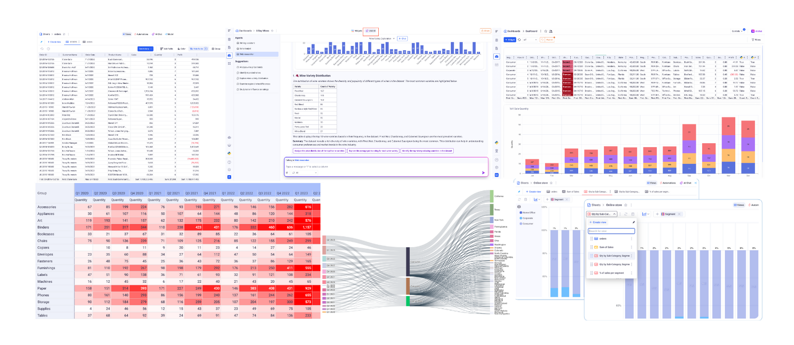

<!-- INLINE FULL-WIDTH HACK -->

<h1>
  
  Welcome to Kawa Documentation
</h1>

### Accelerate your analytics workflows and start smarter with **Kawa** — the fast, simple, and reliable data platform that lets you **build**, **run**, and **scale** projects in minutes. Leverage an intuitive interface, flexible integrations, and enterprise-grade stability alongside AI-powered guidance for formulas, charts, Python scripts, real-time chat, custom agents. **Try Kawa today!**

---

<h2>
  
  Start Your First Project Now
</h2>

Ready to dive in? Start here:

[Getting started](./00__getting_started.html){: .btn .btn-primary }

---
 
<h2>
  
  Short videos to get started with Kawa
</h2>

A step-by-step video guide:

[Video tutorials](https://docs.kawa.ai/video-tutorials/english-tutorials){: .btn .btn-primary target="_blank" }

---

<h2>
  
  What's Inside
</h2>

| Section         | Description                                                                                       |
|----------------|---------------------------------------------------------------------------------------------------|
| [Data Integration](./01_00_data_integration.html) | Connect to internal or external systems to feed data in KAWA                                      |
| [Data Modeling](./02_00_modeling.html) | Create your sheets to share powerful data models with your teams                                  |
| [Computation](03_00_computations.md) | Apply formulas, lookups, and mappings to transform and enrich your data with ease                 |
| [Visualization](./04_00_visualization.html) | Create charts, grids and pivot tables to explore your data in a few clicks                        |
| [Reporting and Publishing](./05_00_publishing.html) | Your data models are ready? Let's publish them with Dashboards or even Data applications          |
| [AI Integration](./06_00_ai_integration.html) | Chat with your data in natural language and create a team of agents to help you with your tasks   |
| [Automations](./07_00_automations.html) | Create your own workflows, powered by your data                                                   |
| [Administration and Sharing](./08_00_administration.html) | Learn more about data security, sharing and permissions                                           |
| [Python Integration](09_00_python_integration.md) | Run Python code to automate tasks, process data, or build custom logic into your workflows        |
| [Architecture](10_00_architecture.md) | Discover how Kawa manages storage, caching, and native connections behind the scenes              |
| [Exploitation](11_00_exploitation.md) | Back up your databases and create monitoring views to track user activity and script execution    |

---

<h2>
  
  Useful Links
</h2>

- [Python SDK](https://github.com/kawa-analytics/kywy-documentation){: target="_blank" }

_Get Python running on Kawa in minutes—no hassle._

- [Install the KAWA Platform](https://github.com/kawa-analytics/kawa-docker-install){: target="_blank" }

_A step-by-step guide to installation and setup._

- [KAWA official website](https://www.kawa.ai){: target="_blank" }

_Explore all features on the official site._

---

  

