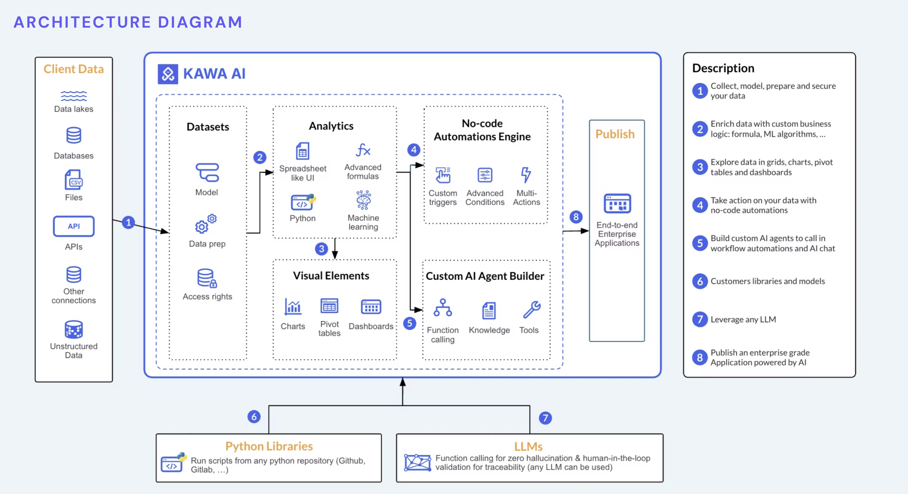

# What is KAWA?

**Kawa is a unified, collaborative analytics workspace** that takes you **from source to app** — connect data, model in sheets and formulas, explore with views and charts, automate actions, and publish dashboards and apps in one place with a shared source of truth, so teams ship faster.

---

## How Kawa works

**Build, run, and scale data apps — fast.**  
Kawa unifies your flow from raw data to published apps. Connect sources, model and compute, explore in views and charts, automate actions, and publish dashboards.

**What you can do**
- **Collect**: databases, APIs, files, unstructured data.
- **Model & compute**: sheets, joins, formulas, lookups, mappings.
- **Explore**: grids, charts, pivots, saved views.
- **Automate**: no-code triggers, conditions, multi-step actions.
- **Publish**: dashboards and end-to-end apps for your team.
- **Extend**: custom logic (Python), reusable libraries, chat & agents.

---

<section class="grid">
  <article class="card">
    <h3>Start Your First Project Now</h3>
    
Ready to dive in? Start here:

    

      <a class="btn btn-primary" href="./00_01_getting_started.html">Getting started</a>
    

  </article>

  <article class="card">
    <h3>Learn by watching</h3>
    
Short videos to get productive fast.

    

      <a class="btn btn-secondary"
         href="https://docs.kawa.ai/video-tutorials/english-tutorials"
         target="_blank" rel="noopener">Video tutorials</a>
    

  </article>
</section>

---

## What's Inside

| Section         | Description                                                                                      
|----------------|--------------------------------------------------------------------------------------------------
| [Terminology](00_02_terminology.md) |Learn the language of Kawa: clear definitions of key terms  and how they relate across the product.
| [Data Integration](./01_00_data_integration.html) | Connect to internal or external systems to feed data in KAWA                                     
| [Data Modeling](./02_00_modeling.html) | Create your sheets to share powerful data models with your teams                                 
| [Computation](03_00_computations.md) | Apply formulas, lookups, and mappings to transform and enrich your data with ease                
| [Visualization](./04_00_visualization.html) | Create charts, grids and pivot tables to explore your data in a few clicks                       
| [Reporting and Publishing](./05_00_publishing.html) | Your data models are ready? Let's publish them with Dashboards or even Data applications         
| [AI Integration](./06_00_ai_integration.html) | Chat with your data in natural language and create a team of agents to help you with your tasks  
| [Automations](./07_00_automations.html) | Create your own workflows, powered by your data                                                  
| [Administration and Sharing](./08_00_administration.html) | Learn more about data security, sharing and permissions                                          
| [Python Integration](09_00_python_integration.md) | Run Python code to automate tasks, process data, or build custom logic into your workflows       
| [Architecture](10_00_architecture.md) | Discover how Kawa manages storage, caching, and native connections behind the scenes             
| [Exploitation](11_00_exploitation.md) | Back up your databases and create monitoring views to track user activity and script execution   
| [Release Notes](12_00_release_notes.md) | Stay up to date with KAWA releases: new features and improvements             

---

## Useful Links

- [Python SDK](https://github.com/kawa-analytics/kywy-documentation){: target="_blank" }

_Get Python running on Kawa in minutes—no hassle._

- [Install the KAWA Platform](https://github.com/kawa-analytics/kawa-docker-install){: target="_blank" }

_A step-by-step guide to installation and setup._

- [KAWA official website](https://www.kawa.ai){: target="_blank" }

_Explore all features on the official site._

---

  

