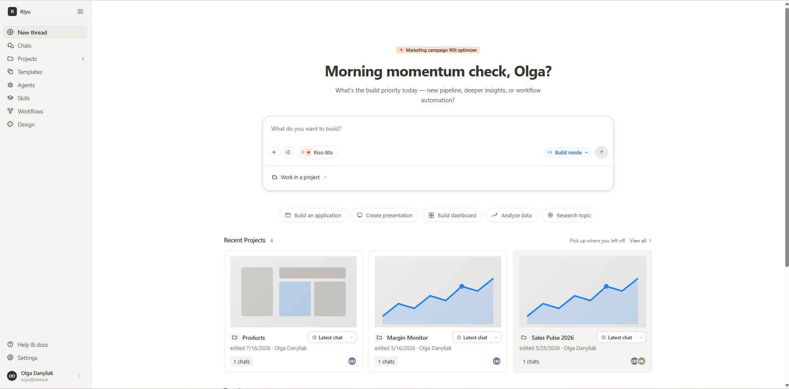
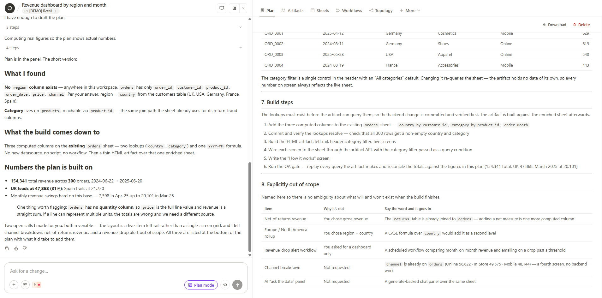
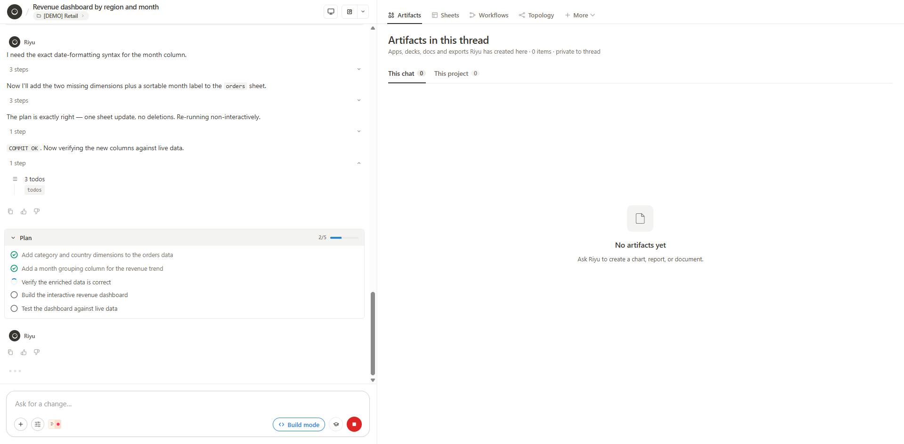
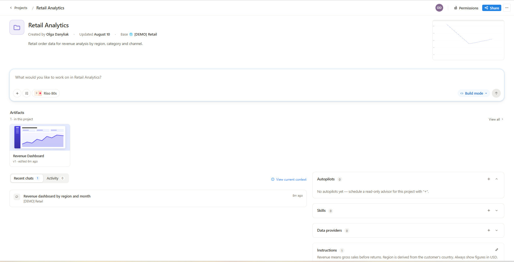
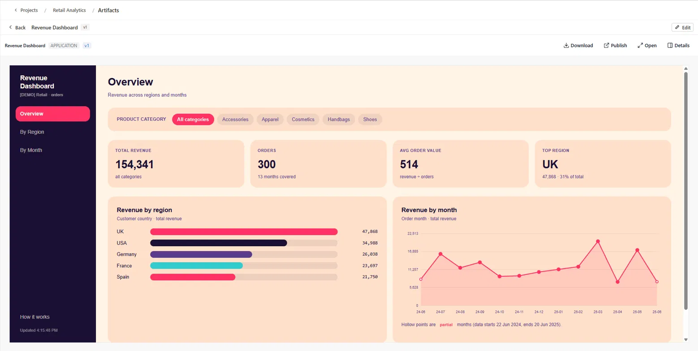
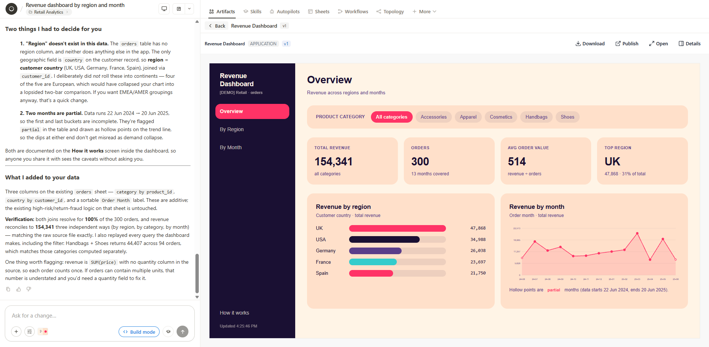
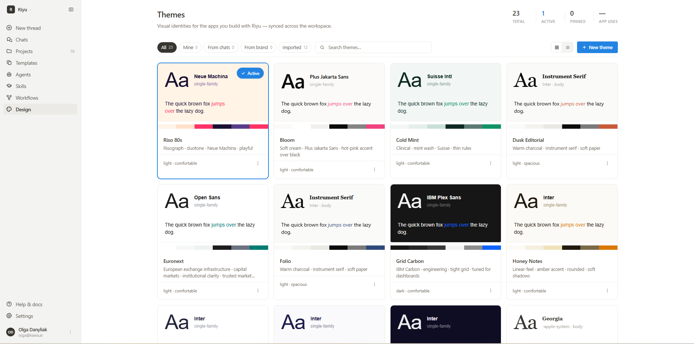

# Riyu — AI co-builder

**Riyu** is KAWA's AI co-builder: you describe the application you need in plain language, and Riyu plans it, connects the data, and ships it. It is a separate working surface from the KAWA analytics workspace — KAWA is where your data models live, Riyu is where you build things on top of them.&#x20;

<figure><figcaption></figcaption></figure>

_The Riyu home screen._

## 1. What you can build

Riyu turns a prompt into a working deliverable. Depending on what you ask for, that can be an application, a dashboard, a presentation, a document, or an analysis of your data. Everything Riyu produces is stored as an artifact and can be revised by continuing the conversation.

Riyu is distinct from the AI features built into the KAWA workspace itself. Those assist you while you configure formulas, charts and scripts, and let you chat with your data. Riyu builds and ships the finished application. See [AI Integration](06_00_ai_integration.md) for the in-product AI features.

## 2. Accessing Riyu

Riyu runs on its own address: `riyu.kawa.ai`. Sign in with your KAWA account. If you do not have access yet, the sign-in page offers a request access form where you can describe what you would like to build.

## 3. The workspace

The left sidebar is the main navigation.

| Item        | Details                                                                                                            |
| ----------- | ------------------------------------------------------------------------------------------------------------------ |
| New thread  | Starts a new conversation with Riyu                                                                                |
| Chats       | All your conversations, with search and filters for shared and archived threads                                    |
| Projects    | Groups artifacts, chats and data into a project your team can share                                                |
| Templates   | Reusable bundles — datasources, sheets, dashboards, workflows — captured from a workspace and shared with the team |
| Agents      | In development                                                                                                     |
| Skills      | Reusable capabilities Riyu can call, from your workspace, your team, or the marketplace                            |
| Workflows   | In development                                                                                                     |
| Design      | Visual identities for the apps you build, synced across the workspace                                              |
| Help & docs | Opens the KAWA documentation site                                                                                  |
| Settings    | In development                                                                                                     |

Your account details, role and usage are shown in the menu at the bottom of the sidebar.

## 4. Starting a build

There are three ways to begin: write a prompt, point Riyu at your data, or start from a template.

### 4.1 Writing a prompt

Riyu works from what you tell it, so the more specific the request, the closer the first result lands. A useful prompt names three things: the data to use, what should be produced, and who will use it.

| Instead of                       | Try                                                                                                                      |
| -------------------------------- | ------------------------------------------------------------------------------------------------------------------------ |
| Build a sales dashboard          | Build a dashboard from the orders table showing revenue by region and by month, with a filter for product category       |
| Analyse our support data         | Analyse the tickets table and show which issue categories take longest to resolve, broken down by team                   |
| Make an app for the finance team | Build an app where the finance team can review pending invoices, mark them approved, and export the approved list to CSV |

You do not have to get everything into the first message. Riyu asks for missing details, and the plan it produces is where you correct course — adjusting it there is cheaper than rebuilding afterwards.

### 4.2 Quick actions

Below the composer, five shortcuts pre-frame the request so you do not have to phrase it yourself:

| Action               | Details                                                   |
| -------------------- | --------------------------------------------------------- |
| Build an application | A full internal app with screens and permissions          |
| Create presentation  | A slide deck generated from your data                     |
| Build dashboard      | A metrics dashboard                                       |
| Analyze data         | An analysis of a dataset, returned as a document or chart |
| Research topic       | A research summary                                        |

### 4.3 The composer

The composer carries a few controls alongside the prompt field:

| Control           | Details                                                                                                             |
| ----------------- | ------------------------------------------------------------------------------------------------------------------- |
| Attach            | Adds files to the conversation as context                                                                           |
| Build settings    | Commit behaviour, plus **Pull from KAWA** to refresh Riyu's view of the live workspace — see section 5.1            |
| Theme             | Sets the visual identity the built app will use — see section 8                                                     |
| Mode              | Sets how Riyu should work on the request — see section 4.4                                                          |
| Work in a project | Scopes the conversation to a project, so it inherits that project's data connection, instructions and other context |

#### 4.4 Modes

The mode sets how far Riyu goes on its own: whether it stays in discussion, works out an approach for you to review, or builds.

| Mode         | Details                                              |
| ------------ | ---------------------------------------------------- |
| Conversation | Ask questions, gather requirements                   |
| Plan mode    | Explore workspace, design the use case, write a plan |
| Build mode   | Edit files, create entities, run `kawa commit`       |

The control in the composer shows whichever mode is currently selected, so its label changes as you switch between them.

In Plan mode, Riyu investigates the workspace using read-only queries and writes a plan to its own tab in the panel beside the conversation. The plan sets out what it found, what it proposes to build, the steps it would take, and — explicitly — what will not be included and what adding each of those would involve. Nothing is applied and the workspace is left untouched, so a plan is safe to ask for even when you are not sure you want the work done.

A plan is kept rather than discarded: you can download it or delete it from the panel.

<figure><figcaption></figcaption></figure>

_A plan written in Plan mode._

There is no approval button on a plan. When you are satisfied with it, switch to Build mode and ask Riyu to carry it out.

#### 4.5 Starting from a template

A template is a reusable bundle captured from an existing workspace — datasources, sheets, dashboards and workflows packaged together and shared with the team. Starting from one gives you a working structure to adapt instead of building from an empty prompt.

The Templates page groups them by domain, and each entry shows who published it and when it was last edited. **Use template** creates a new piece of work from the bundle, which you can then refine in conversation with Riyu.

### 5. How a build runs

A build moves through the same broad stages each time, and Riyu narrates them in the conversation as it goes.

**Establishing context.** Riyu first checks what it has to work with. If something essential is missing or ambiguous — no data attached, a table it cannot find, or work that already exists and would be duplicated — it stops and asks. The question appears as a card in the conversation with suggested answers — sometimes one to choose, sometimes several — and a free-text option if none of them fit. You can also skip it and let Riyu decide.

**Planning.** Riyu breaks the request into a task list and shows it in the conversation, ticking items off as it completes them. The list is visible throughout, so you can see both what it intends to do and how far along it is.

<figure><figcaption></figcaption></figure>

_Riyu working through a build._

**Building and verifying.** Riyu builds against the live data rather than assumptions. It checks each query it intends to use and reconciles the figures against each other before publishing anything.

**Publishing.** The finished result is registered as an artifact and becomes available in the panel beside the conversation.

**Reporting back.** Riyu closes with a summary of what it built, and — importantly — flags the assumptions it had to make and anything it noticed in the data along the way.

> 💡 Read the closing summary rather than skipping to the result. If your request did not match the data exactly, this is where Riyu tells you what it did instead, and where it surfaces caveats about the data itself. The checks run during a build confirm that the figures are consistent with each other; they cannot tell you that the underlying data is the slice you meant. A restricted or filtered source will reconcile perfectly and still answer the wrong question.

#### 5.1 Approvals

How much a build pauses for you depends on the commit behaviour set in the composer:

| Setting              | Details                                                 |
| -------------------- | ------------------------------------------------------- |
| Ask before commit    | Riyu will ask for approval before applying each commit  |
| Commit automatically | Riyu will apply commits immediately, no approval needed |

With commits set to automatic, Riyu carries the request through in a single run, stopping only if it needs an answer from you. With **Ask before commit**, it pauses before writing and asks whether to apply the change. You can open the pending changes to review them first: each one lists what will happen, the entity type and name it affects, and why Riyu wants to make it.

An approval covers exactly the set of changes you reviewed. If Riyu revises them while you are still deciding, the approval no longer matches and it asks for a fresh one, so what gets applied is always what was approved.

> 💡 The setting governs changes to the workspace itself — sheets, columns, datasources and other entities. Publishing an artifact is a different operation, so a build that only creates or edits an artifact runs straight through even with **Ask before commit** on. Expect the prompt when Riyu needs to change the data model underneath, not when it changes the thing it built for you.

The same menu holds **Pull from KAWA**, which refreshes Riyu's view of the live workspace. Use it if the workspace has changed since the conversation started — for example if someone has edited a sheet in KAWA directly — so that Riyu builds against the current state rather than what it saw earlier.

#### 5.2 Versions

Each build produces a new version of the artifact, and the version is shown next to its name. Earlier versions remain available, so you can see how the artifact changed as you refined it in conversation.

### 6. Projects and chats

A project groups artifacts, chats and data into something your team can share, so that every conversation inside it starts with the same context.

Each project has its own page. The composer there opens conversations already scoped to the project, and the panels alongside it hold the context Riyu draws on for all of them:

| Element        | Details                                                                       |
| -------------- | ----------------------------------------------------------------------------- |
| Base           | The data connection the project is built on                                   |
| Instructions   | Standing guidance Riyu follows in every chat in the project                   |
| Skills         | Reusable capabilities available to this project                               |
| Data providers | External file sources the agent can read knowledge from, such as an SFTP drop |
| Autopilots     | Scheduled read-only advisors that run against the project                     |
| Artifacts      | Everything Riyu has built in the project                                      |

Connecting a data provider asks for the host, credentials and a root directory, and lets you label the source and describe what it holds. The password is stored securely and is not shown again afterwards.

<figure><figcaption></figcaption></figure>

_A project and its context._

The page also lists the project's recent chats and its activity, and **View current context** shows exactly what Riyu is working from at that moment — useful when a build behaves unexpectedly and you want to check what the project is actually feeding it.

A project carries a description and a cover image, records who created it and when it was last updated, and gives access to its permissions and sharing from the header. The Projects page separates the ones you own from those shared with you.

A conversation does not have to belong to a project. Chats started outside one are marked as standalone, and the Chats page shows which project each conversation belongs to, alongside filters for shared and archived threads.

### 7. Artifacts

Everything Riyu produces is an artifact. Each one carries its type — an application, a sheet, a document, a deck — and a version, and lives in the panel beside the conversation, so the result sits next to the chat that produced it.

The panel lists artifacts at two scopes. **This chat** shows what Riyu built in the current conversation, which stays private to that thread. **This project** aggregates everything built across the project. Alongside artifacts, the panel also reaches the other parts of the workspace a build touches — skills, sheets, workflows and autopilots.

<figure><figcaption></figcaption></figure>

_The artifacts panel._

**Topology** maps the workspace as a diagram: which datasources feed which sheets, and which artifacts read from them. It is the quickest way to see where an artifact's figures come from, or what else would be affected by changing a sheet underneath it.

<figure><figcaption></figcaption></figure>

_An artifact open beside the conversation that built it._

From the panel you can open an artifact, download it, publish it, or inspect its details. Asking for a change in the same conversation produces a new version rather than a separate artifact.

See the Artifacts page for how artifacts are managed, published and shared.

### 8. Design and themes

A **theme** is a visual identity — typeface, colour palette, spacing and overall styling — applied to the apps you build. Themes live on the Design page and are synced across the workspace, so everything built there shares a consistent look.

<figure><figcaption></figcaption></figure>

_The Themes page._

One theme is active at a time, and that is the one applied to what you build next. You can also pick a theme directly from the composer before starting a build. Applying a different theme later does not rewrite apps that were already built — each app keeps its own version history.

Each theme card previews the typeface, a specimen line, the colour palette, and a short descriptor. It also declares whether the theme is light or dark and how dense its spacing is. Themes can be pinned, and the page tracks how many apps use each one.

Themes are grouped by where they came from:

| Origin     | Details                                              |
| ---------- | ---------------------------------------------------- |
| Mine       | Themes you created in this workspace                 |
| From chats | Themes generated during a conversation with Riyu     |
| From brand | Themes derived from an organisation's brand identity |
| Imported   | Themes brought in from outside the workspace         |

You can also create a theme from scratch with **New theme**, or search the gallery by name.

### 9. Promoting to production

Applications built in Riyu follow KAWA's standard promotion path when they move from a development workspace to production, including the review and evidence requirements that come with it. See [SDLC — governed delivery & SOX controls](sdlc.md) for the full pipeline.
