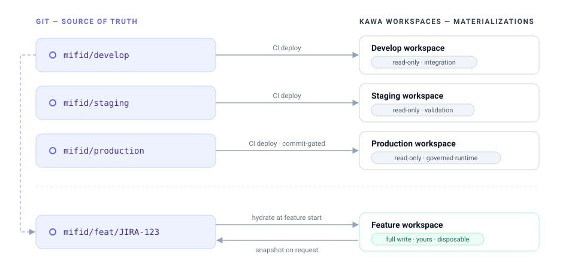
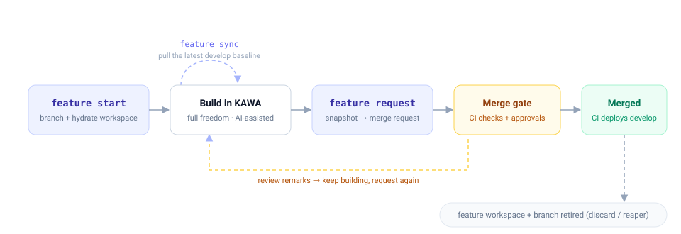
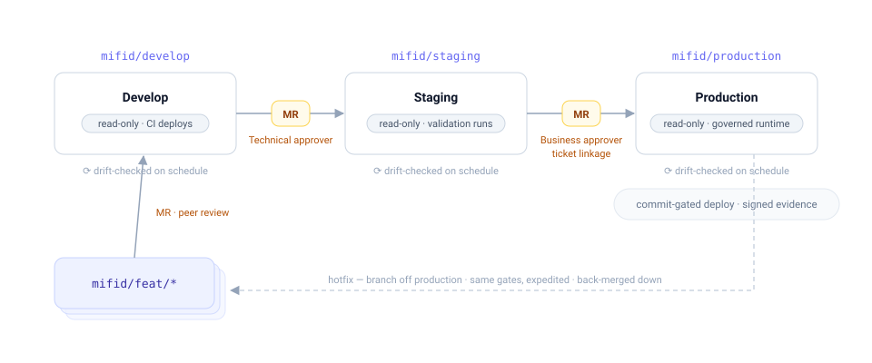

# SDLC — the KAWA development lifecycle

KAWA ships a complete software-development lifecycle for analytics: isolated feature workspaces, Git-backed promotion, environment branches, and gated releases. Builders never touch Git — one CLI verb per lifecycle step drives everything — yet every change reaches production as a reviewed, approved, signed commit. This page describes the working model and the [SOX control framework](#7-sox-controls) it enforces.

## 1. Two operating models

**Not every use case needs a pipeline.** KAWA offers two operating models, and the choice is per use case, not per platform — most deployments run both side by side.

| Model         | How it works                                                                                                             | Use it for                                                                    |
| ------------- | ------------------------------------------------------------------------------------------------------------------------ | ----------------------------------------------------------------------------- |
| **Free mode** | One shared workspace. KAWA's native permission system and roles separate **builders** (create and edit) from **explorers** (consume, filter, drill). No branches, no gates — changes are live immediately. | Self-service analytics: internal dashboards, ad-hoc analysis, team reporting. |
| **SDLC mode** | The lifecycle described on this page: Git-backed environments, feature workspaces, gated promotion, signed deploys.       | Mission-critical and SOX-compliant processes: reconciliation, regulatory reporting (MiFID, EMIR), financial close. |

In Free mode, governance *is* the permission model — see [Sharing and permissions](08_00_administration/08_01_permissions.md). In SDLC mode, governance is structural: nothing reaches a governed environment except through the promotion path. The rest of this page describes SDLC mode.

## 2. The model

**Git is the source of truth. Workspaces are materializations of branches.**

In SDLC mode, the definitive state of an environment is not the workspace — it is a Git branch holding the workspace's full definition as a file tree (one file per entity: datasources, sheets, views, workflows, scripts, dashboards). Workspaces are *deployed copies* of those branches:

<div data-with-frame="true"><figure><figcaption></figcaption></figure></div>

**The tree is pure logic — KAWA as code.** It contains no data, no credentials, and no environment-specific identifiers: entities are addressed by immutable tags, data sources by abstract connection types. Each environment sits on top of **its own data and its own secrets** — development points at dev data with dev credentials, production at production data with production credentials — and supplies them when a tree is deployed (see [secrets & connection isolation](#73-secrets--connection-isolation)). This is what makes the definition fully portable: the *same commit* deploys unchanged to develop, staging, and production, and only the environment underneath it differs.

Environment workspaces are **read-only for humans**: their only write path is the CI deploy principal applying an approved commit. There is nothing to police by discipline — hand-editing a governed environment is structurally impossible.

Every KAWA workspace operates in one of two modes:

| Mode            | Who edits             | Purpose                                                            |
| --------------- | --------------------- | ------------------------------------------------------------------ |
| **Exploration** | Anyone with access    | Regular KAWA permissions. Ad-hoc analysis, prototyping, AI-assisted building. Outside the SDLC. |
| **Governed**    | CI deploy only        | Environment workspaces of an SDLC pipeline. Refuses interactive mutation for everyone, admins included. |

Feature workspaces are exploration-mode by design — they are private and disposable, so builders keep full freedom, including AI assistance.

## 3. Pipelines

**A pipeline binds branches, workspaces, and policy under one name.** Pipelines are declared once, in the promotion repository's `pipelines.toml`:

```toml
[pipeline.mifid-reporting]
repo       = "git@gitlab.example.com:acme/mifid-promotion.git"
branches   = { develop = "mifid/develop", staging = "mifid/staging", production = "mifid/production" }
workspaces = { develop = 771, staging = 772, production = 773 }
policy     = "sox-strict"        # approval gates + evidence profile
ticketing  = { provider = "jira", project = "MIFID" }

[pipeline.sales-analytics]
repo       = "git@gitlab.example.com:acme/sales-promotion.git"
branches   = { develop = "sales/develop", production = "sales/production" }
workspaces = { develop = 810, production = 811 }
policy     = "light"             # peer review only, no ticket linkage
ticketing  = { provider = "linear", team = "SALES" }
```

Builders select a pipeline **by name** — branch names and workspace IDs never appear in the human vocabulary. The number of environments per pipeline is free: two for a light internal pipeline, three or more for regulated delivery.

The **policy profile** decides how much ceremony each merge gate carries: required approver roles, mandatory ticket linkage, and the evidence emitted at deploy time. The same lifecycle runs everywhere; only the gates differ.

### 3.1 Ticketing integration

**Every change is anchored to a ticket in your tracker.** A pipeline plugs into the team's existing ticketing system — Jira, Linear, GitHub Issues, or any provider with a REST API — through the `ticketing` block:

* **Validated at start** — `kawa feature start --ticket MIFID-123` checks the ticket *exists*, is *open*, and (under `sox-strict`) is assigned to the requesting builder. No ticket, no feature branch: the audit chain starts before the first edit.
* **Auto-created where needed** — `kawa release promote` creates the review/change ticket automatically (typed per hop: technical review for staging, change record for production), pre-filled with the plan diff and linked to the merge request. Reviewers work from their tracker, not from Git.
* **Stamped end to end** — the ticket ID travels through the branch name, every commit message, the merge request, and the signed deploy evidence. From a production deploy, the auditor walks back to the ticket in one hop — and from the ticket, forward to everything it changed.
* **Status sync** — ticket transitions follow the lifecycle: *In progress* at start, *In review* at request, *Done* when the change reaches its target environment.

## 4. The feature lifecycle

**One change = one ticket = one branch = one workspace = one merge request.**

<div data-with-frame="true"><figure><figcaption></figcaption></figure></div>

### 4.1 Start

```
$ kawa feature start --pipeline mifid-reporting --ticket JIRA-123 --title "MiFID volume report"
  ✔ branch mifid/feat/JIRA-123 created off mifid/develop @ a1b2c3d
  ✔ feature workspace created and hydrated (round-trip verified)
  → https://kawa.example.com/workspaces/812
```

`start` performs, atomically:

1. Validates the ticket against the pipeline's tracker — it must exist and be open (see [Ticketing integration](#31-ticketing-integration)).
2. Creates the feature branch off the head of the pipeline's `develop` branch (the integration baseline is always the base; `--type hotfix` bases off `production` instead).
3. Creates a fresh KAWA workspace stamped with branch, ticket, and creator.
4. **Hydrates** it from the branch tree and verifies the round-trip: the hydrated workspace re-exports byte-identical to the branch. Data bindings resolve per environment — see [secrets & connection isolation](#73-secrets--connection-isolation).
5. Grants the builder full rights on that workspace, and registers the ticket ↔ branch ↔ workspace binding.

Omitting `--pipeline` lists the pipelines your identity has builder rights on. The KAWA principal who owns the workspace is stamped as the Git author of every subsequent commit — the audit chain has one identity across both systems.

### 4.2 Build

Work in the feature workspace through the normal KAWA UI — no-code, low-code, or AI-assisted. At any point:

```
$ kawa feature status JIRA-123
```

re-exports the workspace and prints a plan-style diff against the branch: *what have I changed so far*.

### 4.3 Sync

The develop baseline moves while your feature is open. Pull it in early:

```
$ kawa feature sync JIRA-123
```

merges the latest `develop` into your feature branch and re-hydrates the delta into your workspace. If another merged change touched the same entities, the conflict surfaces **here** — on entity files, reviewable — not silently at merge time.

### 4.4 Request

```
$ kawa feature request JIRA-123
  ✔ snapshot of workspace 812 → commit on mifid/feat/JIRA-123
  ✔ pushed — merge request !47 opened against mifid/develop
  → https://gitlab.example.com/.../merge_requests/47
```

Because the feature workspace only ever contained your branch plus your work, **the merge-request diff is exactly your change** — nothing from other builders leaks in. `request` is re-runnable: each snapshot adds a commit to the same branch and updates the same merge request.

### 4.5 The merge gate

CI validates every merge request before a human reviews it:

* **Consistency** — the tree is self-contained; every cross-entity reference resolves inside it.
* **Fidelity** — the tree hydrates and re-exports byte-identical.
* **Plan comment** — CI posts a human-readable diff on the merge request: *"merging this changes these entities in develop"* — reviewers read a change summary, not raw definitions.
* **Approvals** — per the pipeline's policy profile, enforced by Git branch protection: peer review (all profiles), ticket linkage and distinct approver roles (`sox-strict`). The author can never approve their own change.

On merge, CI deploys the new `develop` head into the develop workspace, byte-verifies it, and records evidence. The feature workspace and branch are then retired — explicitly via `kawa feature discard JIRA-123`, or by the reaper once the branch is merged or idle past its TTL.

## 5. Releases

**Promotion between environments is a merge request between environment branches**, driven by a different persona and verb:

<div data-with-frame="true"><figure><figcaption></figcaption></figure></div>

```
$ kawa release promote --pipeline mifid-reporting --to staging
$ kawa release promote --pipeline mifid-reporting --to production
```

| Hop                  | Requested by    | Approved by                        | Gate                                            |
| -------------------- | --------------- | ---------------------------------- | ----------------------------------------------- |
| develop → staging    | Release manager | Technical approver                 | Green CI, validation runs on staging            |
| staging → production | Release manager | Business approver                  | Ticket linkage, staging evidence, change record |

The production deploy itself is **commit-gated**: only a commit on the approved `production` branch history can be applied, and the deploy writes a signed evidence bundle (manifest fingerprint + attestation of who deployed what, when) — see [traceability & evidence](#72-traceability--evidence). Rollback is the same gated mechanism pointed at an earlier approved commit.

**Hotfixes** follow the same path with the same approvals, expedited: branch off `production`, merge request into `production`, then back-merge down through `staging` and `develop` so the tiers reconverge.

## 6. Detective controls

Every environment workspace is **drift-checked on schedule**: KAWA re-exports the workspace and byte-compares it against its branch. Any divergence — a failed deploy, a platform fault, an out-of-band change — raises an alert with the exact entity-level diff. Combined with governed mode (which prevents human drift structurally), the branch and the environment cannot silently disagree.

## 7. SOX controls

For pipelines running the `sox-strict` policy profile, the lifecycle above *is* the control framework — nothing sits beside it. This section maps the controls an auditor looks for onto the mechanics that enforce them.

### 7.1 Segregation of duties

**No single person builds, approves, and deploys.** The same person never fills two of these roles for the same change:

| Role                   | Responsibility                                                       | Enforced by                                                       |
| ---------------------- | -------------------------------------------------------------------- | ----------------------------------------------------------------- |
| Builder                | Builds in the feature workspace, requests promotion                  | Merge-request authors can never approve their own change          |
| Technical approver     | Reviews the change; clears the develop and staging gates             | Required approvals on protected branches                          |
| Business approver      | Confirms business impact; clears the production gate                 | Protected branch + mandatory ticket linkage                       |
| CI deploy principal    | The only writer on governed workspaces                               | Governed mode refuses interactive mutation, admins included       |

> **Note:** enforced structurally — Git branch protection plus governed workspace mode — not by policy alone. AI assistance is available in feature workspaces only; governed environments are read-only for humans and agents alike.

### 7.2 Traceability & evidence

**Every deployment carries its own evidence**, written by the deploy itself and bound to the change — it cannot drift from what it describes. The signed bundle contains:

* Change ticket ID and merge request
* Git commit SHA and approver identities
* The plan diff and validation results
* A manifest fingerprint of every deployed file
* Deployment signature, timestamp, and rollback reference

An auditor re-exports the environment and compares it to the manifest, proving byte for byte that what runs is what was approved — and the scheduled [drift checks](#6-detective-controls) run that same proof continuously.

### 7.3 Secrets & connection isolation

**Promoted trees never contain credentials.** A data source is referenced by an abstract, portable type — "Postgres source", "SFTP source" — and each environment resolves it against its own secret store at deploy time. Development, staging, and production therefore run identical logic against different credentials and different data, with no secret ever present in Git, in a workspace definition, or in evidence.

## 8. Command reference

| Verb                                        | Persona           | What it does                                                         |
| ------------------------------------------- | ----------------- | -------------------------------------------------------------------- |
| `kawa feature start --pipeline P --ticket T` | Builder           | Branch off develop, create + hydrate the feature workspace           |
| `kawa feature status T`                     | Builder           | Diff my workspace vs my branch                                       |
| `kawa feature sync T`                       | Builder           | Merge the latest develop baseline into my branch + workspace         |
| `kawa feature request T`                    | Builder           | Snapshot → commit → push → open/update the merge request             |
| `kawa feature discard T`                    | Builder           | Delete the feature workspace, branch, and registry entry             |
| `kawa release promote --to ENV`             | Release manager   | Open the promotion merge request to the next environment             |
| `kawa env plan --pipeline P --env E`        | CI / operator     | Dry-run diff: approved branch vs live environment workspace          |
| `kawa env deploy --pipeline P --env E --commit SHA` | CI        | Apply an approved commit to the environment, verify, emit evidence   |
| `kawa env drift --pipeline P --env E`       | CI (scheduled)    | Detect divergence between an environment and its branch              |

> **Note:** builders only ever need the `feature` verbs. Git — branches, commits, pushes, merge requests — is fully mediated by the CLI; the only Git surface a builder sees is the merge-request page where their change is reviewed.
